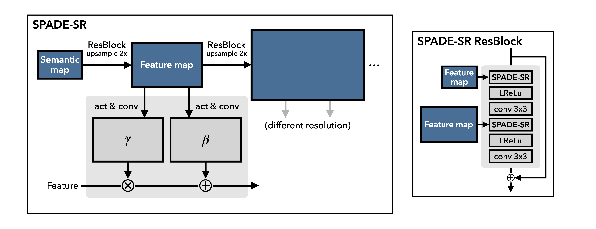
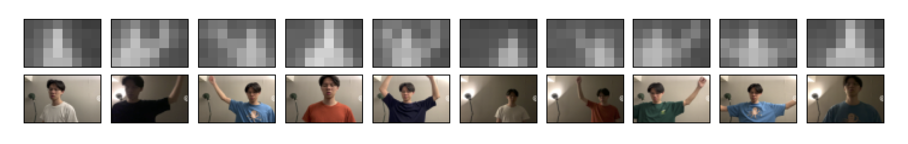
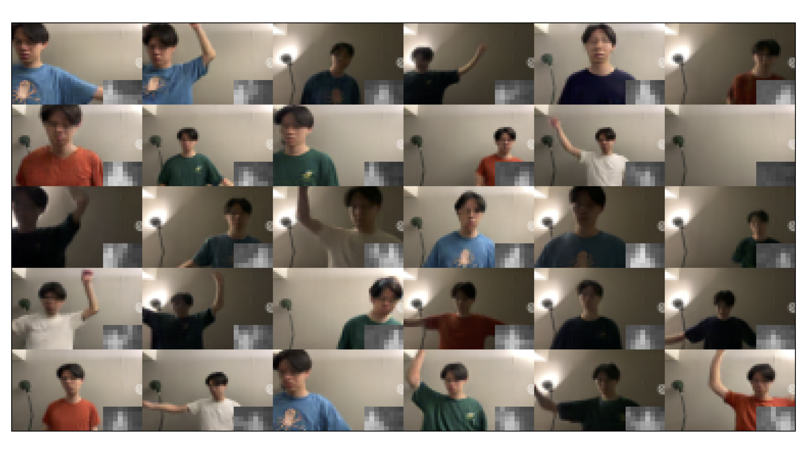
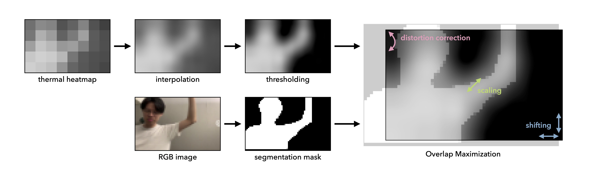

# SPADE-SR and LRT-Human Dataset

This repository contains the code and data for the proposed SPADE-SR (Spatial Adaptive DEnormalization with Self-Sampling) model and LRT-Human (Low-Resolution Thermal Human) dataset for semantic image synthesis using low-resolution thermal heatmaps from a thermopile array sensor.

## Dataset

Download and unzip the dataset. [[Google Drive](https://drive.google.com/file/d/1XyOc3kNJiV66yIR4DQeQDu5F7nNq2v04/view?usp=sharing)]

`rgb`: RGB images

`thermal`: thermal heatmaps

`thermal_calibrated`: calibrated thermal heatmaps (unused)

`thermal_noise05`: thermal heatmaps with noise (SD=0.5 Celsius) added (unused)

`thermal_noise10`: thermal heatmaps with noise (SD=1.0 Celsius) added (unused)

The LRT-Human dataset consists of ~22k low-res thermal heatmap and RGB image pairs of a single human under various scene configurations in a way that thermal and non-thermal attributes can be spotted explicitly. Each folder in the dataset contains data in a single scene, presenting same non-thermal attributes. The `.npy` array file is available for faster data reading, however, it is shuffled and in the shape of `[B,W,H,C]`, which means it isn't grouped in folders.

## Prerequisites
The codes are tested in Python version `3.6.7` and `Tensorflow==1.15`.
Please run

    pip install -r requirements.txt

to install packages.

## GAN Training
To train a model, use the code `train.py` with a configuration file. Please find the folder `cfgs` for example config files.
The following code would train a standard SPADE-SR model:

    python train.py cfgs/SPADE_SR_64.yaml
    
If you want to calculate the FID score on-the-fly whenever the model is saved, in the config file set `CALC_FID: true` and `REAL_STATS_PATH` to your `.npz` feature statistics file. To prepare the pre-calculated feature statistics for your dataset real images, edit and run the code `precalc_stats_example.py`. Please be careful when processing the image data when using OpenCV (cv2), which reads and writes an image in the BGR channel order. *The LRT-Human dataset's `.npy` array file is in BGR channel order,* to reverse the order, simply index `[:,:,:,::-1]`, which reverse the order at the channel axis.

## Inversion
To train a inversion encoder after the GAN training, use the code `inversion.py` with a configuration file. Please find the file `cfgs/inversion.yaml` for available fields. There are 2 options to set the config file:

(Option 1) The Standard Method:

    python inversion.py your-inversion-config.yaml
    
(Option 2) The Auto-Parsing Method:
It's common that many fields in the config file are copies between the GAN and inversion training phase. This method would conveniently auto-parse the fields whose values are commonly the same directly from a GAN training config. Just provide a GAN training folder after the inversion config:

    python inversion.py cfgs/inversion.yaml your-training-folder

A field whose value is set to `None` in the inversion config would be replaced by the field in the GAN training config according to the field relation list `cfg_keypair_list` in `inversion.py`. The list covers common used fields and rarely needs to be edited. *You have to manually set the `GENERATOR` and `DISCRIMINATOR` fields though (just the `.h5` filename itself without path, because the rest would be auto-filled for you).*

## Evaluate

To generate the k times n evaluation grid, use the code `evaluate.py` with a configuration file.

    python evaluate.py your-evaluation-config.yaml
    
Please find the file `cfgs/evaluate.yaml` for available fields.

You can set the config using auto-parsing as well:

    python evaluate.py cfgs/evaluate.yaml your-INVERSION-folder
    
## Calculating MAE
To calculate the reconstruction error according to the paper, use:

    python calc_mae.py your-calc-config.yaml

Please visit `cfgs/calc_mae.yaml` for example config.

## Generating Image Samples

To visualize real and fake image samples, use the code `generate_image_samples.py` with  a configuration file:

    python generate_image_samples.py your-gen-config.yaml

Please visit `cfgs/generate_image_samples.yaml` for example config.

You can set the config using auto-parsing as well:

    python generate_image_samples.py cfgs/generate_image_samples.yaml your-INVERSION-folder

## Data Collection and Processing

The C code for the Arduino sensor MCU is at `grideye_read/grideye_read.ino`. Connect the MCU to the computer and use `data_processing/collect.py` to collect RGB images and temperatures. Use `data_processing/render.py` to transform temperature values into heatmaps and perform alignment. `data_processing/align.py` provides a simple combination-based method for optimal alignment parameter search utilizing additional human segementation masks from MASK-RCNN.
These codes are just for reference and need cleaning-up and better documentation. It's recommended to write your own data collection pipeline.

## References
FID codes are modified from [TTUR](https://github.com/bioinf-jku/TTUR)

Arduino MCU code are modified from [SparkFun](https://github.com/sparkfun/SparkFun_GridEYE_Arduino_Library)

    
